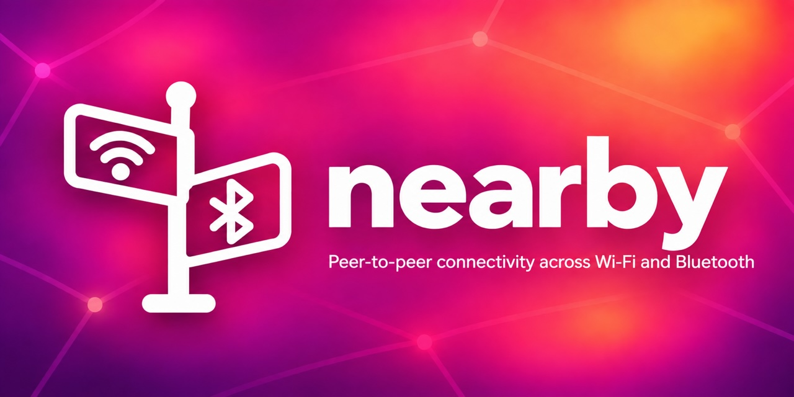

# nearby

<div align="center">
  
</div>

[](https://pub.dev/packages/nearby)
[](https://opensource.org/licenses/BSD-3-Clause)
[](https://github.com/Navideck/nearby)
[](https://github.com/Navideck/nearby)
[](https://pub.dev/packages/nearby/score)
[](https://flutter.dev)
[](https://dart.dev)

A transport-agnostic Flutter plugin for secure peer-to-peer discovery, data transfer, and connectionless broadcasting across local Wi-Fi/LAN and Bluetooth Low Energy (BLE).

Inspired by Apple Multipeer Connectivity and Google Nearby Connections, `nearby` selects and coordinates the available connectivity method behind one API.

For lower-level Bluetooth APIs, see [universal_ble](https://pub.dev/packages/universal_ble) and [universal_bluetooth_classic](https://pub.dev/packages/universal_bluetooth_classic).

## Features

- [Advertising and Discovery](#advertising-and-discovery)
- [Connecting](#connecting)
- [Sending Data](#sending-data)
- [Broadcast Channels](#broadcast-channels)
- [Teardown and Lifecycle](#teardown-and-lifecycle)
- [Platform-specific setup](#platform-specific-setup)
- [API reference](#api-reference)

## API Support

### Connected Sessions (`NearbyService`)

| Capability | Android | iOS | macOS | Windows | Linux |
| :--- | :---: | :---: | :---: | :---: | :---: |
| Wi-Fi/LAN discovery and sessions | ✔️ | ✔️ | ✔️ | ✔️ | ✔️ |
| BLE discovery and outgoing sessions | ✔️ | ✔️ | ✔️ | ✔️ | ✔️ |
| BLE advertising and inbound sessions | ✔️ | ✔️ | ✔️ | ✔️ | ❌ |
| Bytes, files, and streams | ✔️ | ✔️ | ✔️ | ✔️ | ✔️ |
| Encrypted and authenticated sessions | ✔️ | ✔️ | ✔️ | ✔️ | ✔️ |

Connected sessions are 1:1 and use TCP sockets or BLE GATT. Hybrid connections prefer TCP and fall back to BLE when both are available.

### Broadcast Channels (`BroadcastChannel`)

| Capability | Android | iOS | macOS | Windows | Linux |
| :--- | :---: | :---: | :---: | :---: | :---: |
| UDP multicast send and receive | ✔️ | ✔️ | ✔️ | ✔️ | ✔️ |
| BLE advertisement receive | ✔️ | ✔️ | ✔️ | ✔️ | ✔️ |
| BLE advertisement transmit | ✔️ | ✔️ foreground | ✔️ foreground | ✔️ | ❌ |
| Hybrid UDP and BLE operation | ✔️ | ✔️ | ✔️ | ✔️ | UDP only |

Broadcast channels are connectionless 1:many datagrams. They are neither encrypted nor authenticated.

## Getting Started

Add `nearby` to your `pubspec.yaml`:

```yaml
dependencies:
  nearby:
```

Import it where you want to use it:

```dart
import 'package:nearby/nearby.dart';
```

> **Important**: Complete the [Platform-specific setup](#platform-specific-setup) before using discovery, advertising, or broadcasting.

### Initialize `NearbyService`

```dart
final nearby = NearbyService(
  localDisplayName: 'Device A',
  // Optional: persistent peer ID across restarts (random hex ID by default)
  localPeerId: 'device-node-01',
);
```

## Advertising and Discovery

### Start Advertising Presence

```dart
await nearby.startAdvertising(
  options: AdvertisingOptions(
    serviceId: 'nearby-app',
    strategy: DiscoveryStrategy.hybrid,
    securityMode: SecurityMode.preSharedKey,
    preSharedKey: configuredSecret,
  ),
);
```

### Discover Peers

```dart
// Listen to discovered peers
nearby.discoveredPeersStream.listen((peers) {
  for (final peer in peers) {
    print('Found peer: ${peer.displayName} (${peer.id}) via ${peer.discoveredVia.name}');
  }
});

await nearby.startDiscovery(
  options: const DiscoveryOptions(
    serviceId: 'nearby-app',
    strategy: DiscoveryStrategy.hybrid,
  ),
);
```

## Connecting

```dart
// Connect to a peer (TCP first, BLE fallback)
final peers = await nearby.discoveredPeersStream.firstWhere(
  (peers) => peers.isNotEmpty,
);
final connected = await nearby.requestConnection(
  peers.first,
  preSharedKey: configuredSecret,
);
```

`SecurityMode.preSharedKey` mutually authenticates both peers and mixes the
secret into the encrypted session key without sending it. Use
`SecurityMode.pinVerification` instead when users should compare a per-session
SAS PIN, or `SecurityMode.autoAccept` for encrypted but unauthenticated peers.
Connected protocol version 3 does not accept older session frames.

### Handle Inbound Connection and PIN Verification

```dart
// Advertiser verifies PIN with initiator
nearby.connectionRequestsStream.listen((request) {
  print('Request from ${request.peer.displayName} with PIN: ${request.authenticationPin}');
  // Verify PIN visually, then accept:
  nearby.acceptConnection(request.peer.id);
});
```

## Sending Data

```dart
// 1. Send byte message
await nearby.sendBytes(peerId, Uint8List.fromList(utf8.encode('Hello Nearby Peer!')));

// 2. Send file with progress tracking
nearby.payloadProgressStream.listen((update) {
  print('Transfer #${update.payloadId}: ${update.percentage}%');
});
await nearby.sendFile(peerId, File('/path/to/document.pdf'));

// 3. Pipe live byte stream
final streamController = StreamController<List<int>>();
await nearby.sendStream(peerId, streamController.stream);
streamController.add([0x01, 0x02, 0x03]);

// 4. Receive incoming payloads
nearby.payloadReceivedStream.listen((payload) {
  switch (payload.type) {
    case PayloadType.bytes:
      print('Received: ${utf8.decode(payload.bytes!)}');
    case PayloadType.file:
      print('File saved at: ${payload.file!.path}');
    case PayloadType.stream:
      payload.stream!.listen((chunk) => print('Stream chunk: ${chunk.length} bytes'));
  }
});
```

## Broadcast Channels

Broadcast channels support multiple distinct senders and connectionless listeners over UDP and BLE, without pairing. This branch introduces a new wire format; it does not accept the earlier unframed BLE or network broadcasts.

Pass a persistent installation ID as `NearbyService(localPeerId: ...)` or `BroadcastChannel(senderId: ...)`. Every received `senderId` is the same eight-character SHA-256 fingerprint over BLE and LAN, independent of IP address, service name, or BLE address. LAN additionally supplies `fullSenderId`, `address`, `deviceName`, and arbitrary string `attributes`. Fingerprints are 32 bits and can collide; they are not authentication. Broadcasts are neither encrypted nor authenticated.

BLE carries at most **10 application bytes**. Nearby adds a four-byte channel fingerprint and four-byte sender fingerprint. On iOS/macOS, the resulting 18 bytes become `N2` plus unpadded Base64URL in the local name (26 characters; with flags and the AD header, 31 legacy bytes). Android and Windows put the same bytes in manufacturer data. No advertised service UUID, GATT connection, extended advertisement, or fragmentation is required. The caller never constructs a BLE name or manufacturer record. `localName` is network display metadata only.

| Platform | BLE transmit carrier | BLE receive | Network |
| --- | --- | --- | --- |
| Android | Manufacturer data | Yes | Yes |
| iOS/macOS | Local name, foreground | Yes | Yes |
| Windows | Manufacturer data | Yes | Yes |
| Linux | Unsupported peripheral mode | Yes | Yes |
| Web | Unsupported | Unsupported | Unsupported |

Apple background advertising omits local names, so this carrier is foreground-only. Requested update frequency is not an on-air guarantee, especially with Windows' best-effort advertising policy.

Transport failures are emitted on `channel.errors` independently; one unavailable transport does not stop the other. Network transport joins IPv4 interfaces, includes loopback, sends an IPv4 broadcast fallback, and refreshes interfaces every five seconds. Nearby holds Android's multicast lock only while a network listener needs it. BLE receive timestamps use native microsecond timestamps when available. Busy BLE sends skip updates instead of queuing stale bytes.

Scans are shared across Nearby listeners without overwriting `UniversalBle.onScanResult`. Nearby temporarily widens an existing scan; set `BleScanDispatcher.instance.resumeInterruptedScan` to restore the application's previous scan/filter when the last Nearby listener stops. Use only one BLE advertising owner per process; connected peripheral advertising and broadcast advertising share the platform peripheral API.

### Dedicated Broadcast Channel

```dart
// Create a dedicated channel
final channel = nearby.createBroadcastChannel(
  const BroadcastChannelConfig(
    channelId: 'custom-channel',
    strategy: DiscoveryStrategy.hybrid,
    multicastAddress: '239.255.0.1',
    multicastPort: 9876,
    bleCompanyId: 0xFFFF,
  ),
);

// Start listening for incoming broadcast datagrams
await channel.startListening();
channel.stream.listen((packet) {
  print('Broadcast from ${packet.senderId} via ${packet.medium.name}: ${packet.data.length} bytes');
});

// Broadcast datagrams to all nearby devices
await channel.startBroadcasting();
await channel.send(Uint8List.fromList([0x01, 0x02, 0x03, 0x04]), localName: 'Sender-Node');

// Network-only control packets keep Nearby framing but are not advertised over BLE.
await channel.sendNetwork(Uint8List.fromList([0x05, 0x06]));

// A hybrid channel can also listen only on the network transport.
await channel.startListening(strategy: DiscoveryStrategy.networkOnly);
```

### Convenience Service Broadcasts

```dart
// Start listening on the default channel before receiving datagrams
await nearby.defaultBroadcastChannel.startListening();

// Listen on default broadcast stream
nearby.onBroadcastReceived.listen((packet) {
  print('Received broadcast: ${packet.data}');
});

// Quick broadcast on default channel
await nearby.broadcast(Uint8List.fromList([0xAA, 0xBB]));
```

## Teardown and Lifecycle

```dart
// Disconnect individual peers or all
await nearby.disconnectPeer(peerId);
await nearby.disconnectAll();

// Stop discovery / advertising
await nearby.stopDiscovery();
await nearby.stopAdvertising();

// Full cleanup (closes all sockets, BLE scans, and broadcast channels)
await nearby.dispose();
```

## API Reference

### `NearbyService`

| API | Type | Description |
| :--- | :--- | :--- |
| `startAdvertising({options})` | Method | Starts mDNS & BLE peripheral advertising. |
| `advertisingPort` | Getter | Actual TCP port selected for connected sessions. |
| `stopAdvertising()` | Method | Stops advertising and closes inbound servers. |
| `startDiscovery({options})` | Method | Starts browsing for nearby advertising peers. |
| `stopDiscovery()` | Method | Stops discovery and stops scanning. |
| `requestConnection(peer)` | Method | Requests secure connection with Diffie-Hellman handshake. |
| `acceptConnection(peerId)` | Method | Accepts incoming connection request after PIN check. |
| `rejectConnection(peerId)` | Method | Rejects incoming connection request. |
| `sendBytes(peerId, bytes)` | Method | Sends byte payload to connected peer. |
| `sendBytesToAll(bytes)` | Method | Sends byte payload to all connected peers. |
| `sendFile(peerId, file)` | Method | Sends file payload with progress tracking. |
| `sendStream(peerId, stream)` | Method | Pipes continuous byte stream to connected peer. |
| `createBroadcastChannel(config)`| Method | Creates and registers managed 1:Many `BroadcastChannel`. |
| `broadcast(data, ...)` | Method | Convenience method to broadcast datagram to listeners. |
| `onBroadcastReceived` | Stream | Stream of datagrams from default broadcast channel. |
| `discoveredPeersStream` | Stream | Live list of discovered peers. |
| `connectionRequestsStream` | Stream | Inbound connection requests with SAS PINs. |
| `payloadReceivedStream` | Stream | Inbound payload stream (`Bytes`, `File`, `Stream`). |
| `dispose()` | Method | Cleanly shuts down all sessions, servers, and channels. |

## Platform-specific setup

### Android

Add the required local-network and Bluetooth permissions to `android/app/src/main/AndroidManifest.xml`:

```xml
<manifest xmlns:android="http://schemas.android.com/apk/res/android">
    <!-- Local Network Permissions -->
    <uses-permission android:name="android.permission.INTERNET" />
    <uses-permission android:name="android.permission.ACCESS_NETWORK_STATE" />
    <uses-permission android:name="android.permission.ACCESS_WIFI_STATE" />
    <uses-permission android:name="android.permission.CHANGE_WIFI_MULTICAST_STATE" />

    <!-- Bluetooth Permissions (Android 12+) -->
    <uses-permission android:name="android.permission.BLUETOOTH_SCAN" android:usesPermissionFlags="neverForLocation" />
    <uses-permission android:name="android.permission.BLUETOOTH_ADVERTISE" />
    <uses-permission android:name="android.permission.BLUETOOTH_CONNECT" />

    <!-- Legacy Bluetooth Permissions (Android 11 and lower) -->
    <uses-permission android:name="android.permission.BLUETOOTH" android:maxSdkVersion="30" />
    <uses-permission android:name="android.permission.BLUETOOTH_ADMIN" android:maxSdkVersion="30" />
    <uses-permission android:name="android.permission.ACCESS_FINE_LOCATION" android:maxSdkVersion="30" />
</manifest>
```

### iOS and macOS

Add the usage descriptions and Bonjour service to `ios/Runner/Info.plist` and `macos/Runner/Info.plist`:

```xml
<key>NSBluetoothAlwaysUsageDescription</key>
<string>Used to discover and communicate with nearby devices.</string>
<key>NSBluetoothPeripheralUsageDescription</key>
<string>Used to advertise this device to nearby peers.</string>
<key>NSLocalNetworkUsageDescription</key>
<string>Used to discover and connect to nearby peers over Wi-Fi and local network.</string>
<key>NSBonjourServices</key>
<array>
    <string>_nearby-app._tcp</string>
</array>
```

Apple platforms require each Bonjour service type in `NSBonjourServices` to use the `_<serviceId>._tcp` format. The declaration must match the `serviceId` passed to `AdvertisingOptions` and `DiscoveryOptions`; for example, `nearby-app` requires `_nearby-app._tcp`.

#### macOS entitlements

Enable network client/server and Bluetooth in both `DebugProfile.entitlements` and `Release.entitlements`:

```xml
<key>com.apple.security.network.server</key>
<true/>
<key>com.apple.security.network.client</key>
<true/>
<key>com.apple.security.device.bluetooth</key>
<true/>
```

## Testing

Run the full test suite (65+ unit & integration tests):

```bash
flutter test
```

## License

BSD 3-Clause License.
