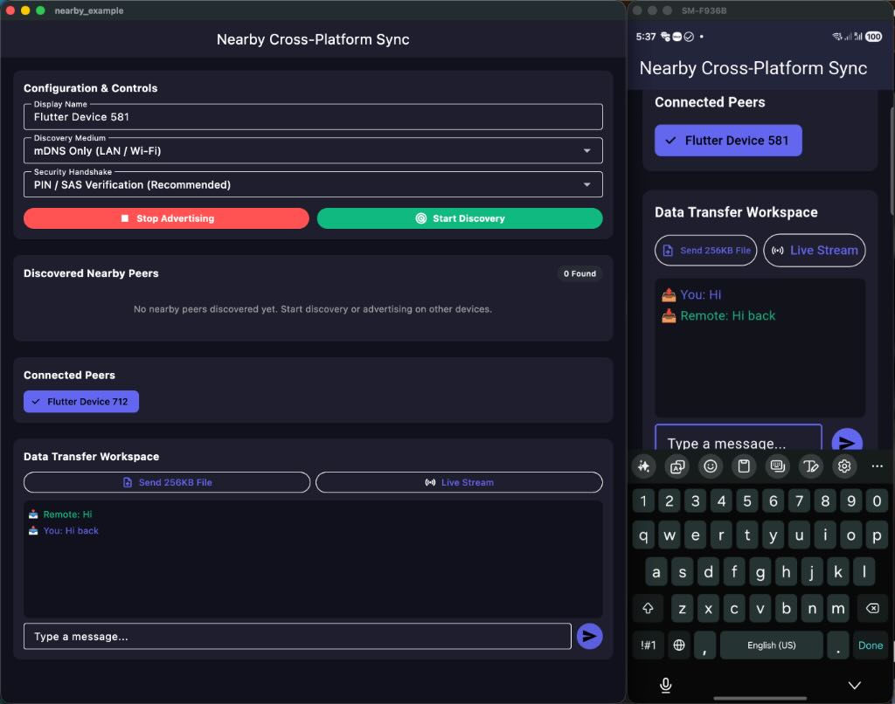

# nearby

Cross-platform peer-to-peer networking for Flutter — bringing the power of Apple's Multipeer Connectivity and Google's Nearby Connections seamlessly across mobile and desktop.

Built with pure Dart socket orchestration on top of **[Bonsoir](https://pub.dev/packages/bonsoir)** (mDNS / Bonjour) and **[Universal BLE](https://pub.dev/packages/universal_ble)** (Bluetooth Low Energy).

<p align="center">
  
</p>

---

## 📱 Platform Support

| Platform | Discovery (mDNS) | Discovery (BLE) | High-Speed TCP | BLE Fallback |
| -------- | :--------------: | :-------------: | :------------: | :----------: |
| Android  | ✅               | ✅              | ✅             | ✅           |
| iOS      | ✅               | ✅              | ✅             | ✅           |
| macOS    | ✅               | ✅              | ✅             | ✅           |
| Windows  | ✅               | ✅              | ✅             | ✅           |
| Linux    | ✅               | ⚠️*             | ✅             | ⚠️*          |

\* *Linux supports BLE Central mode (scanning and connecting) only; BLE Peripheral advertising is not supported on Linux.*

---

## ✨ Features

- **🚀 Hybrid Discovery**: Simultaneous dual-channel discovery combining zero-config local network broadcast (mDNS / Bonjour) with Bluetooth Low Energy (BLE) peripheral/central scanning.
- **⚡ High-Throughput Direct TCP Sockets**: Primary payload channel uses framing-optimized raw TCP sockets with zero latency and high file transfer rates over local network (Wi-Fi or Ethernet).
- **📶 Seamless BLE Fallback**: Automatic GATT characteristic fallback when peers are in Bluetooth proximity but not connected to the same Wi-Fi network.
- **🔒 Flexible Security Handshake**:
  - **Auto-Accept Mode**: Rapid pairing for automated devices.
  - **SAS PIN Verification**: Cryptographically derived Short Authentication String (4 or 6-digit symmetric PIN) for visual user verification on both screens.
- **📦 Multi-Type Payload Engine**:
  - **Bytes**: Fast, reliable byte packets for messages, control commands, and JSON payloads.
  - **File**: High-speed chunked file transfers with live progress callbacks, percentage tracking, and cancellation.
  - **Stream**: Real-time continuous byte streaming for audio, video chunks, and sensor telemetry.
- **🖥️ True Cross-Platform**: Android, iOS, macOS, Windows, and Linux.

---

## 🏗️ Architecture & Protocol

```
+-------------------------------------------------------------+
|                      NearbyService                          |
+-------------------------------------------------------------+
|                    NearbySession Engine                     |
+------------------------------+------------------------------+
|     Discovery Coordinator    |        Payload Engine        |
|  +------------+------------+ | +---------+--------+-------+ |
|  |   Bonsoir  |  Univ. BLE | | |  Bytes  |  File  | Stream| |
|  |   (mDNS)   |   (BLE)    | | +---------+--------+-------+ |
+--+------------+------------+-+---------------+--------------+
|       Packet Framer (Magic Bytes + Length + CRC32)          |
+------------------------------+------------------------------+
|   TCP Socket (High Bandwidth)|   BLE GATT (Direct Fallback) |
+------------------------------+------------------------------+
```

Every frame on the wire is wrapped by the packet framer (`magic bytes → length → body → CRC32`), so corrupted or partial reads are detected and dropped rather than desynchronizing the stream.

---

## 📦 Installation

Add to your `pubspec.yaml`:

```yaml
dependencies:
  nearby:
    path: /path/to/nearby   # or git/pub once published
```

Then run:

```bash
flutter pub get
```

> **Note**: This package is pure Dart on top of Bonsoir and Universal BLE. Make sure your host app also declares the platform permissions below.

---

## 📱 Platform Setup & Permissions

### Android (`android/app/src/main/AndroidManifest.xml`)

```xml
<!-- Local Network & mDNS -->
<uses-permission android:name="android.permission.INTERNET" />
<uses-permission android:name="android.permission.ACCESS_NETWORK_STATE" />
<uses-permission android:name="android.permission.ACCESS_WIFI_STATE" />
<uses-permission android:name="android.permission.CHANGE_WIFI_STATE" />
<uses-permission android:name="android.permission.CHANGE_WIFI_MULTICAST_STATE" />
<uses-permission android:name="android.permission.NEARBY_WIFI_DEVICES" android:usesPermissionFlags="neverForLocation" />

<!-- Bluetooth & Proximity -->
<uses-permission android:name="android.permission.BLUETOOTH" android:maxSdkVersion="30" />
<uses-permission android:name="android.permission.BLUETOOTH_ADMIN" android:maxSdkVersion="30" />
<uses-permission android:name="android.permission.ACCESS_FINE_LOCATION" />
<uses-permission android:name="android.permission.BLUETOOTH_SCAN" android:usesPermissionFlags="neverForLocation" />
<uses-permission android:name="android.permission.BLUETOOTH_ADVERTISE" />
<uses-permission android:name="android.permission.BLUETOOTH_CONNECT" />
```

Runtime permissions (`BLUETOOTH_SCAN` / `BLUETOOTH_CONNECT` / `NEARBY_WIFI_DEVICES` depending on OS version) must be requested from Dart before starting discovery/advertising — e.g. with [`permission_handler`](https://pub.dev/packages/permission_handler).

### iOS (`ios/Runner/Info.plist`) & macOS (`macos/Runner/Info.plist`)

```xml
<key>NSBluetoothAlwaysUsageDescription</key>
<string>Used to discover and communicate with nearby devices.</string>
<key>NSBluetoothPeripheralUsageDescription</key>
<string>Used to advertise this device to nearby peers.</string>
<key>NSLocalNetworkUsageDescription</key>
<string>Used to discover and connect to nearby peers over Wi-Fi and local network.</string>
<key>NSBonjourServices</key>
<array>
    <string>_nearby-app._tcp</string>
</array>
```

> Replace `_nearby-app._tcp` with `<your-serviceId>._tcp` if you use a custom `serviceId`.

### macOS Entitlements (`macos/Runner/*.entitlements`)

Sandboxed macOS apps must enable network client/server and Bluetooth entitlements in **both** DebugProfile and Release:

```xml
<key>com.apple.security.network.server</key>
<true/>
<key>com.apple.security.network.client</key>
<true/>
<key>com.apple.security.device.bluetooth</key>
<true/>
```

### Linux Requirements

- **mDNS / Avahi**: Ensure the Avahi daemon and client libraries are installed:
  ```bash
  sudo apt install avahi-daemon libavahi-client-dev
  ```
- **Bluetooth**: Requires BlueZ (`sudo apt install bluez`). Note: `universal_ble` supports BLE Central mode (scanning and connecting) on Linux; BLE Peripheral advertising is not currently supported.

---

## 🚀 Quick Start

### 1. Initialize `NearbyService`

```dart
import 'package:nearby/nearby.dart';

final nearby = NearbyService(
  localDisplayName: 'My iPad Pro',
  // Optional: stable peer identity across restarts (random UUID by default)
  // localPeerId: 'my-stable-device-id',
  //
  // Optional: where incoming file payloads are written
  // storageDirectory: await getApplicationDocumentsDirectory(),
);
```

### 2. Advertise Device

```dart
await nearby.startAdvertising(
  options: const AdvertisingOptions(
    serviceId: 'nearby-app',
    strategy: DiscoveryStrategy.hybrid,
    securityMode: SecurityMode.pinVerification, // or SecurityMode.autoAccept
  ),
);
```

### 3. Discover Nearby Peers

```dart
// Listen to discovered peers
nearby.discoveredPeersStream.listen((peers) {
  for (final peer in peers) {
    print('Found peer: ${peer.displayName} (${peer.id}) via ${peer.discoveredVia.name}');
  }
});

await nearby.startDiscovery(
  options: const DiscoveryOptions(
    serviceId: 'nearby-app',
    strategy: DiscoveryStrategy.hybrid,
  ),
);
```

### 4. Connect & Handshake

Both devices should run advertising **and** discovery for bidirectional visibility.

**Initiator** — request a connection to a discovered peer:

```dart
final success = await nearby.requestConnection(peer);

// Track connection lifecycle + get the SAS PIN shown on this device
nearby.peerStateStream.listen((update) {
  print('${update.peer.displayName}: ${update.state.name} (PIN: ${update.sasPin})');
});
```

**Receiver (advertiser)** — handle incoming connection requests and verify the PIN:

```dart
nearby.connectionRequestsStream.listen((request) {
  print('Incoming request from ${request.peer.displayName} with PIN: ${request.authenticationPin}');
  // Show request.authenticationPin to the user and compare with the initiator's screen,
  // then accept or reject:
  nearby.acceptConnection(request.peer.id);
  // Or reject:
  // nearby.rejectConnection(request.peer.id, reason: 'Busy');
});
```

With `SecurityMode.autoAccept`, incoming requests are accepted automatically and never appear on `connectionRequestsStream`.

### 5. Send & Receive Payloads

#### Send Byte Packet (Messages / Commands)
```dart
final bytes = Uint8List.fromList(utf8.encode('Hello Nearby Peer!'));
await nearby.sendBytes(peerId, bytes);

// Or broadcast to all connected peers
await nearby.sendBytesToAll(bytes);
```

#### Send File with Progress Updates
```dart
final file = File('/path/to/my_image.png');
await nearby.sendFile(peerId, file, customFileName: 'vacation.png');

// Track live progress
nearby.payloadProgressStream.listen((update) {
  print('Payload #${update.payloadId}: ${update.percentage}% (${update.bytesTransferred}/${update.totalBytes} bytes)');
});
```

#### Cancel an In-Flight Transfer
```dart
nearby.cancelPayload(payloadId);
```

#### Stream Continuous Telemetry / Audio
```dart
final streamController = StreamController<List<int>>();
await nearby.sendStream(peerId, streamController.stream);

// Push stream chunks in real-time
streamController.add([1, 2, 3, 4]);
```

#### Receive Incoming Payloads
```dart
nearby.payloadReceivedStream.listen((payload) {
  switch (payload.type) {
    case PayloadType.bytes:
      final text = utf8.decode(payload.bytes!);
      print('Received message: $text');
    case PayloadType.file:
      print('Received file at: ${payload.file!.path} (${payload.fileName})');
    case PayloadType.stream:
      print('Receiving real-time stream...');
      payload.stream!.listen((chunk) {
        // Process stream chunk
      });
  }
});
```

### 6. Disconnect & Tear Down

```dart
await nearby.disconnectPeer(peerId);       // single session
await nearby.disconnectAll();               // every session
await nearby.stopDiscovery();
await nearby.stopAdvertising();
await nearby.dispose();                     // full teardown
```

---

## 📖 API Overview

### `NearbyService`

| Member | Description |
| ------ | ----------- |
| `startAdvertising({options})` | Broadcast presence over mDNS and/or BLE and listen for inbound connections. |
| `stopAdvertising()` | Stop broadcasting and close inbound servers. |
| `startDiscovery({options})` | Browse for advertising peers. |
| `stopDiscovery()` | Stop browsing. |
| `requestConnection(peer)` | Connect to a discovered peer (TCP first, BLE fallback) and run the handshake. Returns `Future<bool>`. |
| `acceptConnection(peerId)` | Accept a pending incoming request. |
| `rejectConnection(peerId, {reason})` | Reject a pending incoming request. |
| `disconnectPeer(peerId)` / `disconnectAll()` | Terminate one or all sessions. |
| `sendBytes(peerId, bytes)` / `sendBytesToAll(bytes)` | Send byte payloads. |
| `sendFile(peerId, file, {customFileName})` | Send a file with chunked progress. |
| `sendStream(peerId, stream)` | Pipe a continuous byte stream. |
| `cancelPayload(payloadId)` | Abort an in-progress transfer. |
| `dispose()` | Shut down everything. |

Streams: `discoveredPeersStream`, `connectionRequestsStream`, `peerStateStream`, `payloadReceivedStream`, `payloadProgressStream`.
Getters: `discoveredPeers`, `connectedPeers`, `isAdvertising`, `isDiscovering`.

### Key Models

| Model | Notes |
| ----- | ----- |
| `Peer` | `id`, `displayName`, `metadata`, `discoveredVia` (`mdns` / `ble` / `hybrid`), `ipAddress`, `port`, `bleDeviceId`, `rssi`, `lastSeen`. |
| `AdvertisingOptions` | `serviceId` (required), `strategy`, `securityMode`, `metadata` (TXT record), `port` (fixed TCP port; dynamic if omitted). |
| `DiscoveryOptions` | `serviceId` (required), `strategy`, `metadataFilter`. |
| `ConnectionRequest` | Incoming request with `peer`, `authenticationPin`, `metadata`. |
| `NearbyPayload` | Received payload; inspect `type` then `bytes` / `file` / `stream`. |
| `PayloadTransferUpdate` | `payloadId`, `bytesTransferred`, `totalBytes`, `status`, `percentage`. |

### Behavior Notes

- Up to **32 concurrent sessions/pending handshakes** are supported; further inbound connections are dropped.
- Incoming handshakes time out after **15 seconds**.
- Connection attempts try **TCP first**, falling back to BLE when the LAN socket fails or the peer has no IP/port.
- Duplicate inbound connections from an already-connected peer are rejected automatically.

---

## 🧪 Testing

Run all unit tests, framing verifications, and mock integration suites:

```bash
flutter test
```

## 📂 Example

A complete working demo lives in [`example/`](example/) — run it on two physical devices (or simulators on the same machine) to see discovery, PIN verification, and file transfer end-to-end:

```bash
cd example && flutter run
```
